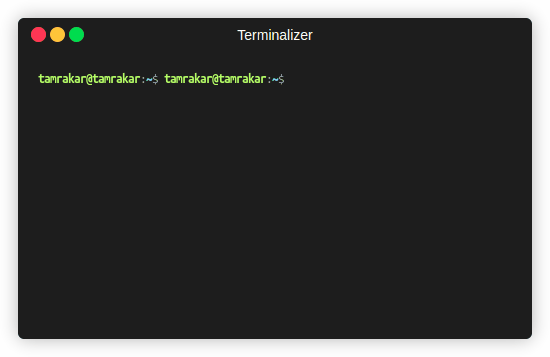

<div align="center">
    
</div>

<h1 align="center">📦 BuzzLink</h1>
<p align="center"><strong>Simple, Secure, and Shareable File Uploads via CLI</strong></p>

<p align="center">
  
  
  
  
</p>

---

## ✨ Features

- 📤 **Instant file uploads** to [buzzheavier.com](https://buzzheavier.com)
- 🔐 **Optional password protection** (using `7z` or `zip`)
- 📝 **Attach a note** with your file
- 📋 **Auto-copy download link** to clipboard
- 📱 **QR code generation** for mobile-friendly sharing
- ✅ Beautiful, color-coded CLI feedback
- 💨 Blazing fast and lightweight—just one script!

---

## 🚀 Installation

Download the script:

```bash
curl -Lo buzzlink https://raw.githubusercontent.com/scifisatan/buzzlink/main/buzzlink.sh
chmod +x buzzlink
sudo mv buzzlink /usr/local/bin

````
> Make sure `/usr/local/bin` is in your `$PATH`.
---

## 🛠 Requirements

Ensure these are installed on your system:

* [`curl`](https://curl.se/)
* [`qrencode`](https://fukuchi.org/works/qrencode/)
* One clipboard tool: `xclip`, `wl-copy`, or `pbcopy`
* One encryption tool: `7z` or `zip`

Install with:

```bash
# Ubuntu / Debian
sudo apt install curl qrencode zip xclip p7zip-full

# macOS (via Homebrew)
brew install curl qrencode zip p7zip pbcopy
```

---

## 📦 Usage

```bash
buzzlink [OPTIONS] <file | directory>
```

### Options

| Flag      | Description                           |
| --------- | --------------------------------------|
| `-h`      | Show help message                     |
| `-n NOTE` | Add a base64-encoded note to the file |
| `-p PASS` | Password-protect the file (7z/zip)    |

### Examples

## Basic File Upload

```bash
buzzlink image.jpg
```

## Upload a Directory
```bash
buzzlink folder/
```

## Upload with a note
```bash
buzzlink -n "Company invoice" invoice.pdf
```

## Encrypted upload
```bash
buzzlink -p "topsecret" design.sketch
```

## 🔐 Security

When using `-p`, your file is encrypted *locally* before upload using either `7z` or `zip` with AES encryption. BuzzLink does **not** store or log your password.

---

## 📁 Where are files hosted?

BuzzLink uploads files to:

```
https://w.buzzheavier.com/<FILENAME>
```

And generates a short link like:

```
https://buzzheavier.com/<ID>
```

---

## 🧹 Cleanup

Temporary encrypted files are automatically deleted after upload.

---

## 🙋 FAQ

### ❓ What happens if I forget my password?

Encrypted files **cannot** be decrypted without the correct password. Store it securely.

### 📂 Can I share multiple files?

Currently, only one file at a time. Consider zipping them together before uploading.

### ⚙️ Can I change the host domain?

Right now it's hardcoded. Future versions may support config overrides.

---

## 📣 Contributing

Pull requests are welcome! Feel free to [open an issue](https://github.com/yourusername/buzzlink/issues) or suggest new features.

---

## 📄 License

This project is licensed under the [MIT License](LICENSE).

---

## ❤️ Acknowledgments

Built with love and Bash for the open-source community.
